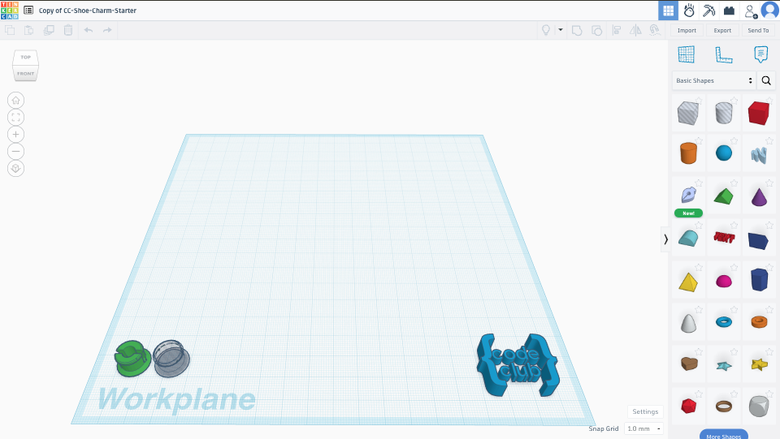

## Create a new project

If you have been given a code to join a class.

--- task ---

Join your class by entering the code you have been given [here](https://www.tinkercad.com/joinclass){:target="_blank"}.

--- /task ---

If you want to create your own account.

--- task ---

Sign up for a Tinkercad account [here](https://www.tinkercad.com/join){:target="_blank"}.

--- /task --- 

--- task ---

Open the [starter design](https://www.tinkercad.com/things/17sUhbDWiRe-cc-shoe-charm-starter){target="_blank"}.

--- /task ---

--- task ---

Click the blue 'Tinker this' button.

--- /task ---
