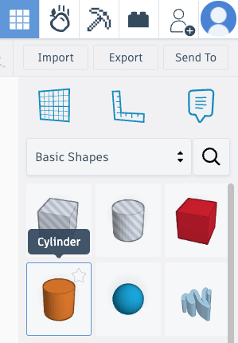
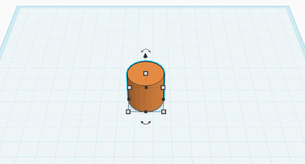
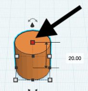
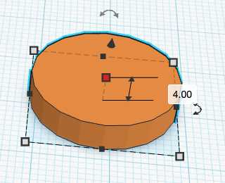
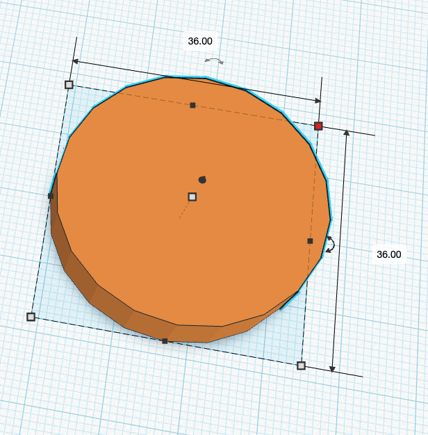
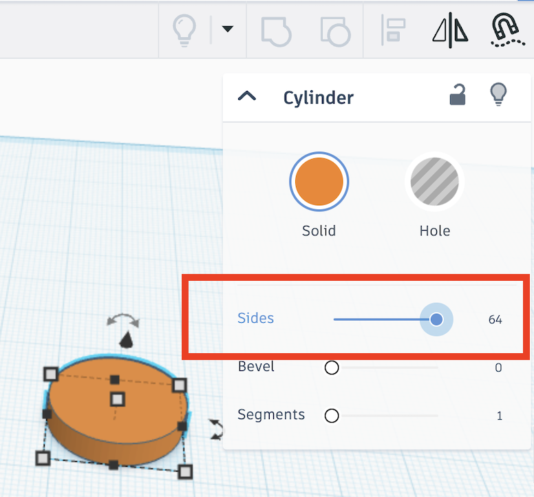
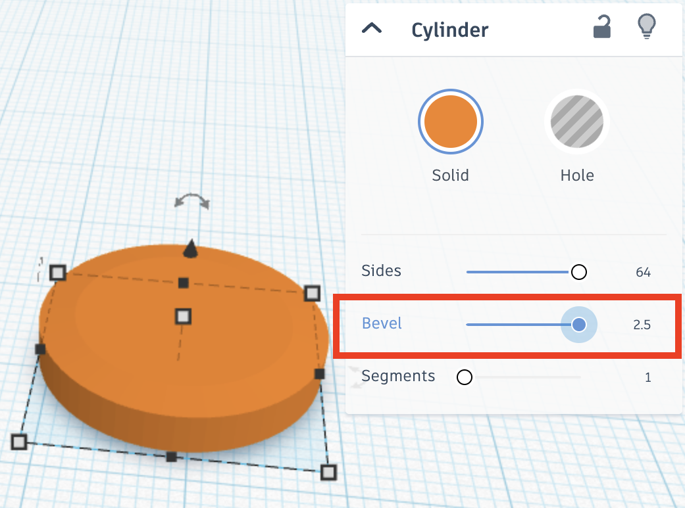
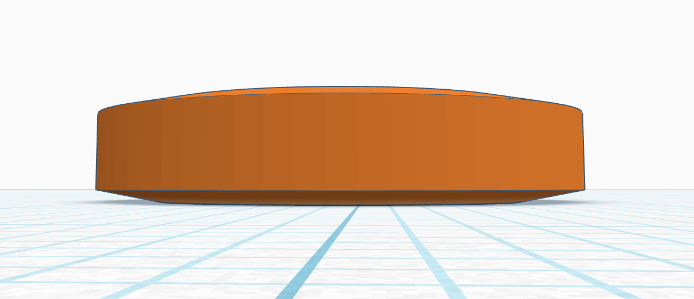

## Create a button

--- task ---

Left-click on the cylinder shape. 

Move it to the workplane.

Left-click again to place it.

--- /task ---

--- task ---

Left-click the height node.

It will turn red and the height of the cylinder (in mm) will be shown.

--- /task ---

--- task ---

Drag the height node down (or type in the box) to change the height to `4.00`.

--- /task ---

--- task ---

Hold the <kbd>SHIFT</kbd> key and drag the corner node until the height and width are both `36.00`.

--- /task ---

--- task ---

Change the sides value to `64`.

This creates a smoother outline for the cylinder.

--- /task ---

--- task ---

Change the bevel value to `2.5`.

--- /task ---

Your button now has a curved top and bottom. Nice!

