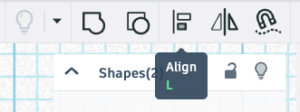
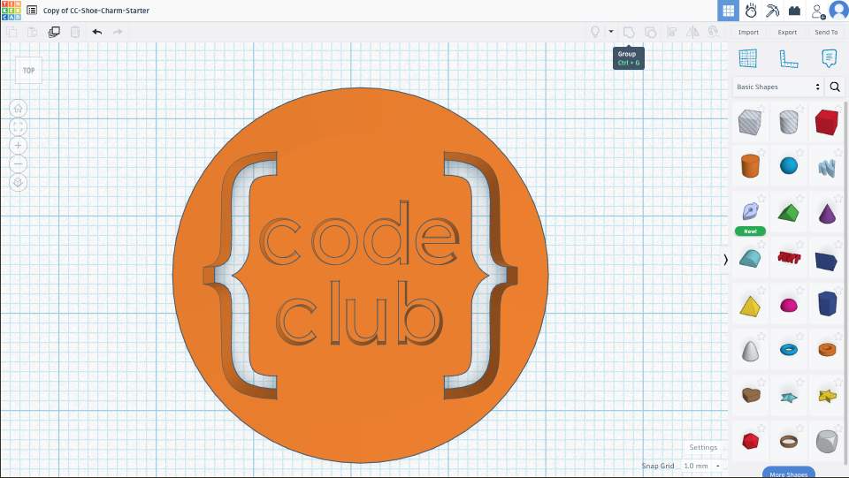

## Create a cutout

--- task ---

Drag the Code Club logo object on top of your cylinder object. 

--- /task ---

--- task ---

Press the <kbd>F</kbd> key to fit the view to the selected object.

--- /task ---

--- task ---

Select the **Top** view.

--- /task ---

--- task ---

Hold down <kbd>Ctrl</kbd> and press <kbd>A</kbd> (<kbd>Cmd⌘</kbd> and <kbd>A</kbd> on a Mac) to select both objects.

--- /task ---

--- task ---

Click **Align** to help you position the logo centrally.

--- /task ---

--- task ---

Make sure **ONLY** the logo is selected.

Change its shape to 'Hole'.

--- /task ---

--- task ---

Select both objects again.

--- /task ---

--- task ---

Group the objects.

The logo will be cut out of the button!

--- /task ---
