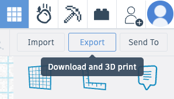
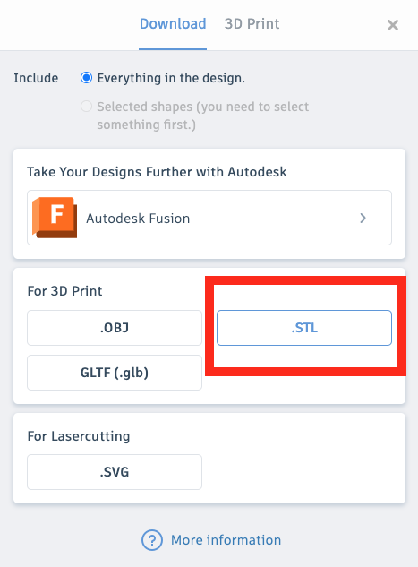

## 3D print your charm

Tinkercad can print directly to supported 3D printers and can also export an `.STL` file for 3D printing.

**Note**: The colour of your charm will be the colour of the filament you use. 
Changing the colour of your objects in Tinkercad will not change the filament colour.

--- task ---

Click **Export**.

 

--- /task ---

--- task ---

Choose .STL and remember where you save your file.

 

--- /task ---

--- task ---

There are lots of tools that can read STL files and send 3D models to a printer. 

The one you choose will depend on the 3D printer that you are using. 

--- /task ---

--- task ---

Carefully remove the 3D print from the print bed. 
	
**TODO**
 
		
--- /task ---

--- task ---

You might need to remove some small strands of filament to tidy up the print. 

--- /task ---

