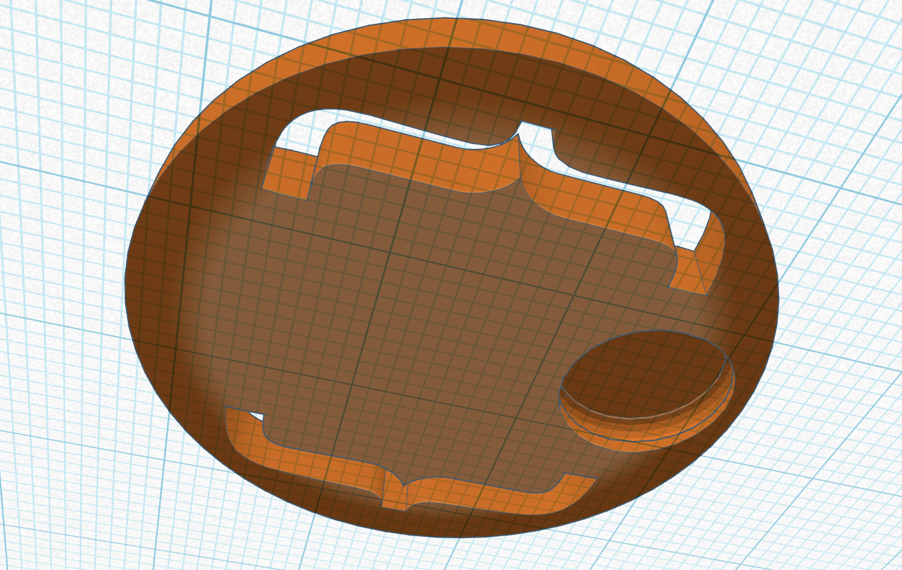
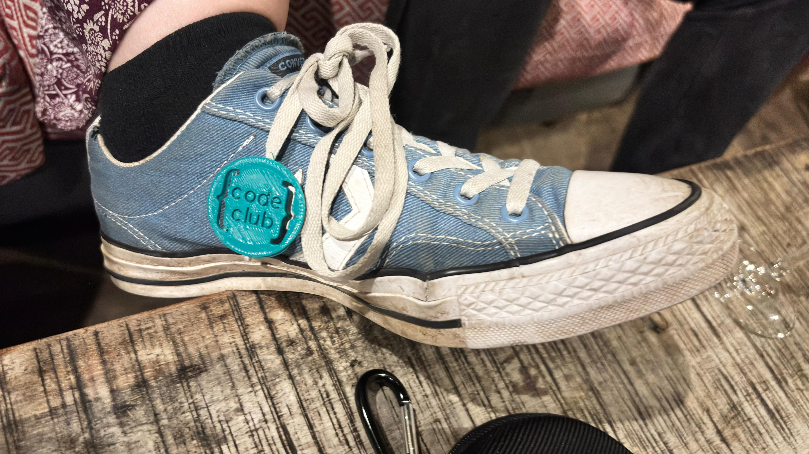

## Challenge

--- task ---

Change the logo to your name.

--- /task ---

--- task ---

Add, edit and group some shapes to create new cutouts, or change your button from a cylinder to a different shape.

--- /task ---

--- task ---

- Add the snap fit hole.

- Then group it with the charm to cut out the socket shape in the charm.

- Print the snap object to fit into the socket you have made in the charm, securing your charm on your shoe!

--- /task ---
